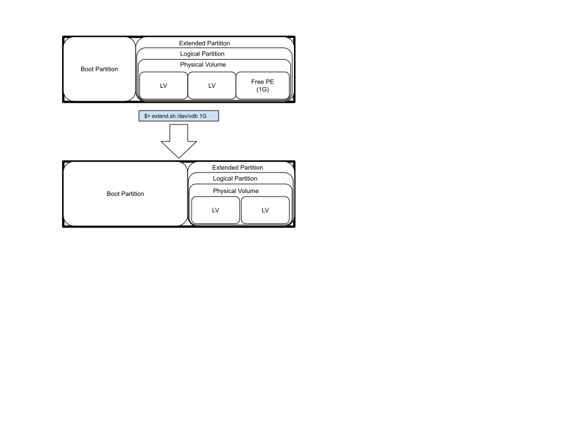

# bash-extend-boot-partition
Script to extend the ext4/xfs boot partition in a BIOS system by shifting the adjacent partition to the boot partition by the parametrized size.
It expects the device to have enough free space to shift to the right of the adjacent partition, that is towards the end of the device. The free space
can come as already free space between the adjacent partition to boot and the subsequent partition or end of disk or, in case of devices containing an LVM partition,
free PEs in the PV that holds the adjacent partition to boot.




It only works with ext4 and xfs file systems and supports adjacent partitions as primary or logical partitions and LVM in the partition.

The script determines which partition number is the boot partition by looking for the boot flag.
This process won't work with an EFI boot partition because the boot partition that contains the kernel and the initramfs are in a partition that does not have the flag.
The parametrized size supports M for MiB and G for GiB. If no units is given, it is interpreted as bytes

Usage: $>extend.sh <device_name> <increase_size_with_units>

Example
 Given this device partition:
   Number  Start   End     Size    Type      File system  Flags
           32.3kB  1049kB  1016kB            Free Space
   1       1049kB  11.1GB  11.1GB  primary   ext4         boot
   2       11.1GB  32.2GB  21.1GB  extended
   5       11.1GB  32.2GB  21.1GB  logical   ext4

 Running the command:
   $>extend.sh /dev/vdb 1G
 or
   $>extend.sh /dev/vdb 1073741824

 Will increase the boot partition in /dev/vdb by 1G and shift the adjacent partition in the device by the equal amount.

   Number  Start   End     Size    Type      File system  Flags
           32.3kB  1049kB  1016kB            Free Space
   1       1049kB  12.2GB  12.2GB  primary   ext4         boot
   2       12.2GB  32.2GB  20.0GB  extended
   5       12.2GB  32.2GB  20.0GB  logical   ext4 


# Dependencies
This script requires the following binaries to work:
* /usr/sbin/resize2fs
* /usr/bin/awk
* /usr/sbin/tune2fs
* /usr/sbin/sfdisk (=> v2.38.1)
* /usr/sbin/partprobe
* /usr/sbin/parted
* /usr/bin/sed
* /usr/bin/numfmt
* /usr/sbin/lvm
* /usr/bin/lsblk
* /usr/sbin/e2fsck
* /usr/sbin/fdisk
* /usr/bin/findmnt
* /usr/bin/wc
* /usr/bin/tail

# Building sfdisk from the source
There are known issues with the `move-data` flag in `sfdisk` prior to v2.38.1 that could cause loss of data when performing the move operation. If your environment lacks a version of `sfdisk` equal or greater than v2.38.1 you will need to update it to a version equal or greater than 2.38.1. In case of older systems where there are no prebuild rpms available, you'll need to build it directly from the source.  

Here are the recommended steps to install `sfdisk` version 2.38.1 in your environment from the source directly.

* Download and untar the source code for v2.38.1 (this is the last version that works well with CentOS and RHEL 7 due to issues with the configuration (see https://wiki.strongswan.org/issues/3406)
```
[root@localhost ~]# wget https://github.com/util-linux/util-linux/archive/refs/tags/v2.38.1.tar.gz
```

* Install the required dependencies as listed when running the `autogen.sh` using your preferred package manager:
```
[root@localhost ~]# yum install gettext-devel libtool bison automake -y
```

* Run the `autogen.sh` command in the unpacked `util-linux` directory:
```
[root@localhost ~]# cd util-linux-2.38.1/
[root@localhost ~]# ./autogen.sh
```

* Configure the build to enable statically linked binaries:
```
[root@localhost ~]# ./configure --enable-static-programs=sfdisk
```

* Run the make command to generate the binary:
```
[root@localhost ~]# make sfdisk.static
```

* Replace your existing `sfdisk` with the new binary:
```
[root@localhost ~]# cp sfdisk.static /usr/sbin/sfdisk
```